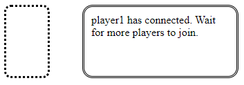
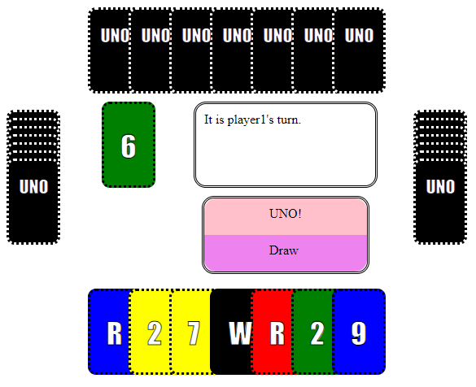

Another game project with React and JavaScript. Follows the same principles as the Ludo project I did. Again, the code isn't perfect but is a lot better optimized and readable than Ludo's. The main purpose of this project was to get to grips with `CSS grid layout`.

Before hosting the game with `node server.js` in a terminal, make sure to `npm install`.

To connect to the game, input this url into your browser: `http://localhost:8000/`. The game will start only after the arrival of the 4th player. Initial player turn order is fixed.

House rules that I'm familiar with have been applied in order to make the game:
1. Other than black cards, the player must use a card that either has the same colour, number, or letter as the card in play.
2. If the player does not wish to play a card (for whatever reason), they may draw a card from the deck.
3. If the player does not have any legal cards to play, they will have to draw a card from the deck.
4. If the player is down to their last card, they must say 'UNO!' (click the `UNO!` button) before the next player does their turn. If the player is too late, they will have to draw two cards.
5. If a player uses a 'Skip' card, `S`, the next player's turn is skipped.
6. If a player uses a 'Reverse' card, `R`, the turn order is reversed. It is also the current player's turn again.
7. If a player uses a 'Draw 2' card, `D`, the next player has to draw two cards from the deck. The next player's turn is NOT SKIPPED.
8. If a player uses a 'Wild' card, `W`, the player can change the color of the card in play (by clicking on any of the colors in the dialog box and then the `W` card again). The player's turn then ends. The next player has to play a card with the same colour as chosen.
9. If a player uses a 'Wild Draw 4' card, `Z`, the player can change the colour of the card in play while also making the next player draw four cards from the deck.
10. The first player to reach an empty hand will be chosen as the winner.

Here is what the game looks like when a match has started:

Known bugs (I've forgotten to fix):
1. Sometimes, if a player changes the color of the card in play, the next player may have to click a legal card twice. State is probably being prematurely overwritten.
2. The very first time the game begins, if you hover the mouse to your own hand, the leftmost card is highlighted instead of the one being hovered over. Only seems to happen once.
